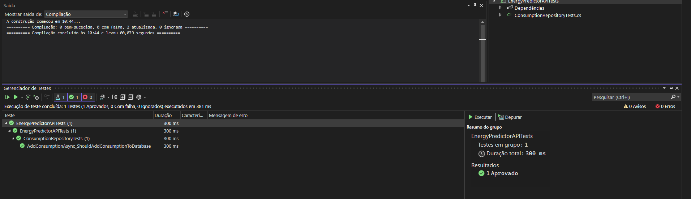

# GLOBAL SOLUTION FIAP : 2° semestre de 2024

## Advanced Business Development With .NET
 
## Descrição do Projeto

Nosso projeto implementa uma API em .NET que utiliza Inteligência Artificial para prever o consumo energético de dispositivos com base em seus tipos e dados históricos. Essa solução foi desenhada para melhorar processos de energia sustentável ao fornecer informações úteis e precisas para uma gestão mais eficiente do uso de energia.

# Integrantes

- Diogo Dias Rodrigues Gallina - RM98605 – 2TDSS
- João Dubas Leal Kleye Souza - RM76153 – 2TDSS
- Pedro Henrique Couto Archilha - RM550450 – 2TDSS
- Pedro Henrique Lourenço Rodrigues - RM98402 – 2TDSS
- Rafael Klanfer Nunes - RM99791 – 2TDSA

# Link para o repositório no GitHub

https://github.com/rafaelknunes/9-global-solution-2-sem

# O que você vai encontrar neste README?

- A) Explicação sobre a estrutura de pastas do projeto.
- B) Um roteiro sobre como usar a API.
- C) Uma explicação completa justificando como implementamos os requisitos pedidos na documentação.

-----

# **(A) Estrutura de pastas do projeto**

- EnergyPredictorAPI: É a solução principal do projeto, contendo a API que usa ML.NET para prever consumo de energia por aparelho.
- EnergyPredictorAPITests: É o projeto de testes unitários, contendo os testes para as classes principais do projeto.

---

# **(B) Roteiro sobre como usar a API**

### **1. Listar dados históricos de consumo**
Use o endpoint `GET /api/energyconsumption/list` para visualizar os dados históricos armazenados no banco de dados. Este é o primeiro passo para entender quais dados estão disponíveis.

**Exemplo de Requisição**:
```http
GET /api/energyconsumption/list
```

**Resposta (Exemplo)**:
```json
[
    {
        "id": 1,
        "deviceId": "TV-001",
        "deviceType": "TV",
        "timestamp": "2024-11-18T12:30:00Z",
        "consumption": 120.5
    },
    {
        "id": 2,
        "deviceId": "FRIDGE-001",
        "deviceType": "Geladeira",
        "timestamp": "2024-11-18T14:45:00Z",
        "consumption": 85.3
    }
]
```

### **2. Adicionar um dado de consumo**
Adicione dados ao banco para um dispositivo específico. Este é o segundo passo caso precise registrar novos consumos.

**Endpoint**:  
```
POST /api/energyconsumption/add
```

**Parâmetros**:
- **deviceId** (string): Identificador único do dispositivo.  
- **deviceType** (string): Tipo do dispositivo (ex.: "TV", "Geladeira").  
- **timestamp** (datetime): Data e hora do registro.  
- **consumption** (float): Valor do consumo registrado.  

**Exemplo de Requisição**:
```json
POST /api/energyconsumption/add
Content-Type: application/json

{
    "deviceId": "TV-002",
    "deviceType": "TV",
    "timestamp": "2024-11-18T16:00:00Z",
    "consumption": 130.7
}
```

**Resposta**:
```json
"Dado de consumo adicionado com sucesso."
```

### **3. Treinar o modelo**
Treine o modelo de previsão de consumo com os dados armazenados. Este é o terceiro passo para garantir que o modelo esteja atualizado antes de realizar previsões.

**Endpoint**:  
```
POST /api/energyconsumption/train
```

**Exemplo de Requisição**:
```http
POST /api/energyconsumption/train
```

**Resposta**:
```json
"Modelo treinado com sucesso e salvo no arquivo."
```

### **4. Fazer uma previsão de consumo**
Este endpoint realiza previsões de consumo para um tipo específico de dispositivo. Execute este passo após treinar o modelo.

**Endpoint**:  
```
POST /api/energyconsumption/predict
```

**Parâmetros**:
- **deviceType** (string): Tipo do dispositivo (ex.: "TV", "Geladeira").  

**Exemplo de Requisição**:
```json
POST /api/energyconsumption/predict
Content-Type: application/json

{
    "deviceType": "Geladeira"
}
```

**Resposta (Exemplo)**:
```json
{
    "PredictedConsumption": 172.4
}
```

-----

# **(C) Requisitos pedidos na documentação**

# **Requisito: Desenvolver uma API em .NET que colabore com melhoria de processos de energia sustentável**

Nosso projeto implementa uma **API em .NET** que utiliza **Inteligência Artificial** para prever o consumo energético de dispositivos com base em seus tipos e dados históricos. Essa solução foi desenhada para **melhorar processos de energia sustentável** ao fornecer informações úteis e precisas para uma gestão mais eficiente do uso de energia.

### **1. Previsão do Consumo Energético**
A API utiliza Machine Learning para prever o consumo energético de diferentes dispositivos, através do endpoint `/api/EnergyConsumption/predict` . Isso permite que empresas e usuários:
- **Identifiquem padrões de consumo:** Ajuda a determinar quais dispositivos têm maior impacto no consumo de energia.
- **Otimizem recursos energéticos:** Com previsões precisas, é possível planejar o uso de dispositivos de forma eficiente, reduzindo picos de consumo e evitando desperdícios.
- **Suportem decisões estratégicas:** Empresas podem usar as informações para sugerir substituição de dispositivos menos eficientes ou ajustes em horários de uso.

### **2. Integração e Automação**
A API foi projetada para integração em sistemas existentes de gerenciamento de energia, tornando-a facilmente aplicável em residências, empresas e indústrias.

Nas demais disciplinas desta Global Solution, especialmente na de IoT, desenvolvemos dispositivos que coletam dados de consumo de energia e os enviam para uma API. Com base nesses dados, a API gera previsões de consumo e fornece informações valiosas para otimização do uso de energia.

No entanto, no presente projeto, a inserção dos dados de consumo ainda é feita de maneira manual através do endpoint `/api/EnergyConsumption/add`, que recebe um JSON com os dados de consumo de um dispositivo em um determinado período de tempo.

Também é possível listar todas as entradas de dados através do endpoint `/api/EnergyConsumption/list`.

### **3. Baseada em Dados Reais**
O modelo de previsão da API foi treinado com dados simulados. Porém, pode perfeitamente ser treinado com dados reais, armazenados em um banco de dados Oracle.
- **Treinamento contínuo:** O modelo pode ser re-treinado com novos dados para melhorar sua precisão. Para isso disponibilizamos a rota `/api/EnergyConsumption/train` que realiza o treinamento do modelo com os dados armazenados no banco de dados.
- **Escalabilidade:** Suporte a diferentes tipos de dispositivos e volumes de dados crescentes, sem comprometer a qualidade das previsões.

---

# **Requisito: Implementar testes unitários utilizando o xUnit.**

O teste usará um banco de dados in-memory para simular o comportamento do AppDbContext. Isso permite testar sem afetar o banco de dados real.



**Cenário de Teste:**
O teste verifica se o método `AddConsumptionAsync` do repositório de consumo (`ConsumptionRepository`) adiciona corretamente um registro de consumo ao banco de dados simulado.

**Descrição do Teste:**
- Cria-se um banco de dados em memória para simular o ambiente real.
- Um objeto `ConsumptionData` válido é instanciado e passado para o método `AddConsumptionAsync`.
- Após a execução do método, verificamos:
  - Se o banco de dados contém exatamente um registro.
  - Se os dados adicionados correspondem aos valores inseridos.

**Objetivo:**
Garantir que a funcionalidade de adicionar dados de consumo ao repositório funcione conforme o esperado, com validação de comportamento para dados válidos.

**Importância:**
Este teste assegura que a aplicação é capaz de armazenar registros corretamente, algo essencial para o funcionamento dos endpoints da API que dependem de dados persistidos.

**Resultado Esperado:**
- O método adiciona o registro ao banco de dados simulado sem erros.
- Os dados persistidos são idênticos aos fornecidos.

---

# **Requisito: Design Patterns**

### **Design Patterns aplicados na solução**

### **1. Repository Pattern**
- **Onde foi aplicado?**
  - Na implementação da interface `IConsumptionRepository` e sua classe concreta `ConsumptionRepository`, que interagem com o banco de dados.
- **Como funciona?**
  - O **Repository Pattern** abstrai a lógica de acesso a dados, permitindo que as operações de CRUD sejam realizadas sem expor detalhes de infraestrutura para a aplicação.
- **Benefícios:**
  - Promove a separação de responsabilidades.
  - Facilita testes unitários ao permitir a troca do repositório real por um mock durante os testes.
  - Isola a lógica de acesso a dados, tornando o código mais limpo e reutilizável.

### **2. Dependency Injection (DI)**
- **Onde foi aplicado?**
  - No `Program.cs`, ao registrar dependências como `AppDbContext`, `IConsumptionRepository`, e `ModelTrainer` no contêiner de serviços.
- **Como funciona?**
  - O **DI Pattern** permite que dependências sejam injetadas automaticamente nos construtores das classes. Por exemplo, o `EnergyConsumptionController` recebe `IConsumptionRepository` e `ModelTrainer` como dependências.
- **Benefícios:**
  - Reduz o acoplamento entre classes.
  - Facilita testes, pois permite trocar dependências reais por mocks ou stubs.
  - Melhora a manutenção e extensibilidade.

### **3. Factory Pattern**
- **Onde foi aplicado?**
  - Implicitamente, no uso de **MLContext** para criar objetos relacionados a Machine Learning, como pipelines e prediction engines.
- **Como funciona?**
  - O **Factory Pattern** é usado para centralizar a criação de objetos complexos. Aqui, o **ML.NET** utiliza o `MLContext` como uma fábrica para criar modelos e pipelines de treinamento.
- **Benefícios:**
  - Simplifica a criação de objetos complexos.
  - Torna o código mais limpo e fácil de configurar.

### **4. Singleton Pattern**
- **Onde foi aplicado?**
  - No uso do `MLContext`, que é projetado para ser reutilizado em toda a aplicação.
- **Como funciona?**
  - O **Singleton Pattern** garante que apenas uma instância do `MLContext` seja usada, evitando custos desnecessários de inicialização.
- **Benefícios:**
  - Otimiza recursos, já que o `MLContext` é uma estrutura pesada.
  - Evita inconsistências, pois todas as operações de Machine Learning compartilham o mesmo contexto.

---

# **Requisito: Aplicar práticas de Clean Code e SOLID**

### **Clean Code**
Código limpo é simples de entender e modificar. No projeto, aplicamos boas práticas como:

- **Nomeação clara**: Métodos e variáveis com nomes autoexplicativos, como `TrainModel` e `Predict`, deixam a intenção clara.
- **Estrutura organizada**: Classes distribuídas em pastas lógicas (`Controllers`, `Services`, `Models`) para facilitar manutenção.
- **Métodos pequenos e focados**: Cada método realiza uma única tarefa específica, reduzindo a complexidade.
- **Documentação**: Comentários e XML integrados ao Swagger fornecem informações precisas para desenvolvedores e usuários da API.

### **Princípios SOLID**

#### 1. **Single Responsibility Principle (SRP)**  
Cada classe tem uma única responsabilidade:  
- **EnergyConsumptionController**: Gerencia as interações com a API.  
- **ModelTrainer**: Cuida exclusivamente de treinamento e previsão de consumo.  
- **ConsumptionRepository**: Lida com o acesso a dados no banco.

#### 2. **Open/Closed Principle (OCP)**  
As classes podem ser estendidas sem precisar ser modificadas:
- A injeção de dependência em `ModelTrainer` e `EnergyConsumptionController` permite substituir repositórios ou contextos sem alterar o código principal.

#### 3. **Interface Segregation Principle (ISP)**  
Interfaces são projetadas para evitar dependências desnecessárias:
- **IConsumptionRepository** contém apenas métodos relevantes, como `AddConsumptionAsync` e `GetConsumptionsAsync`.


